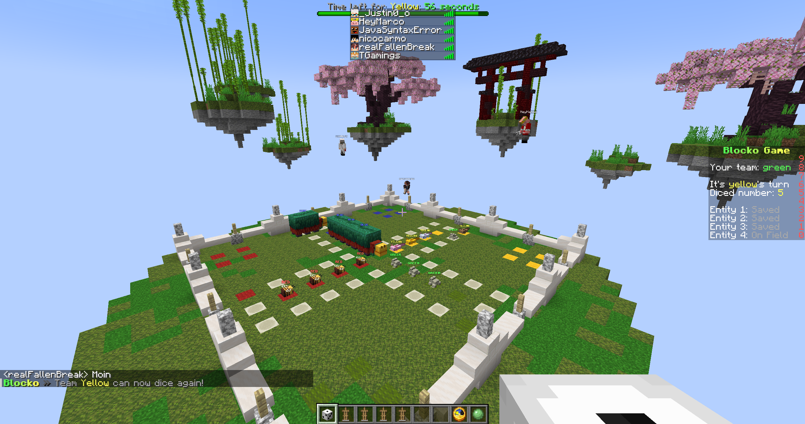
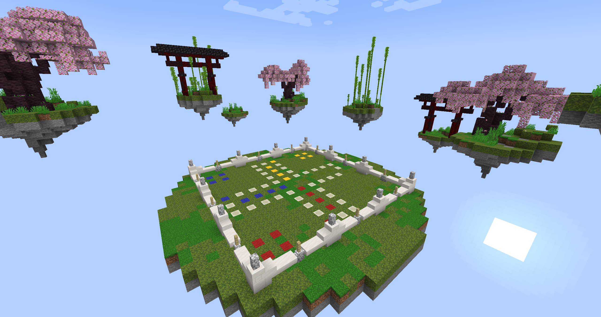
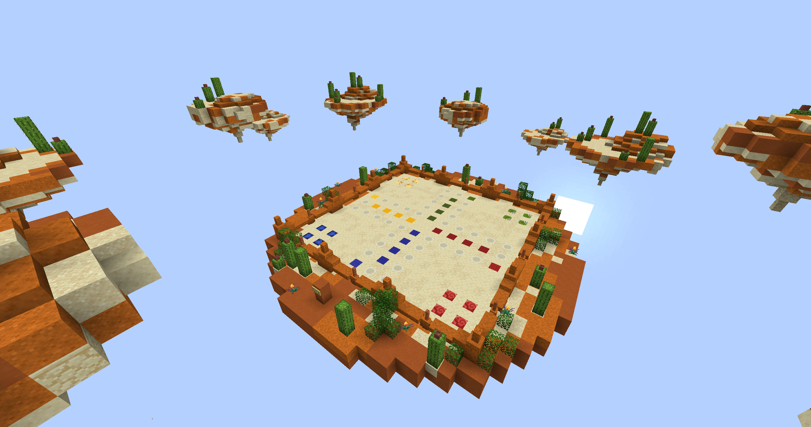
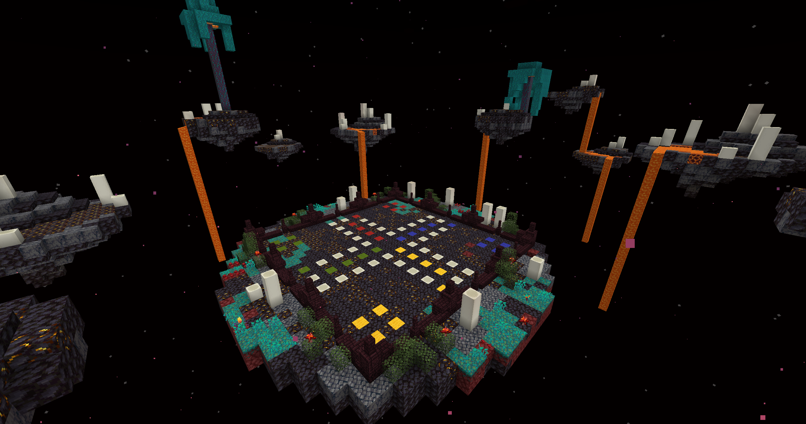
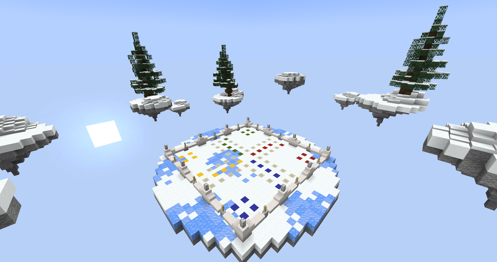

# Blocko

**Blocko** is a Minecraft (Paper) minigame plugin that brings a dice-based board game experience to your server. Players roll dice to move across themed game boards, collect entities, compete in teams, and race to victory. Think of it as a Mario Party–style board game inside Minecraft—with achievements, stats, AI opponents, and multiple arena maps to choose from.

## Screenshots

### Gameplay

### Game Boards

| Asia | Desert | Nether | Winter |
|------|--------|--------|--------|
|  |  |  |  |